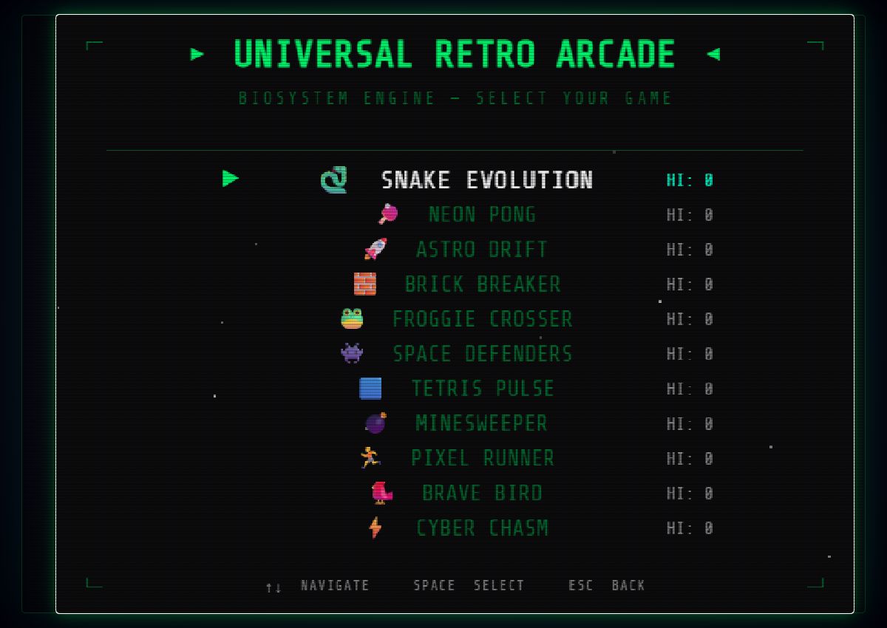
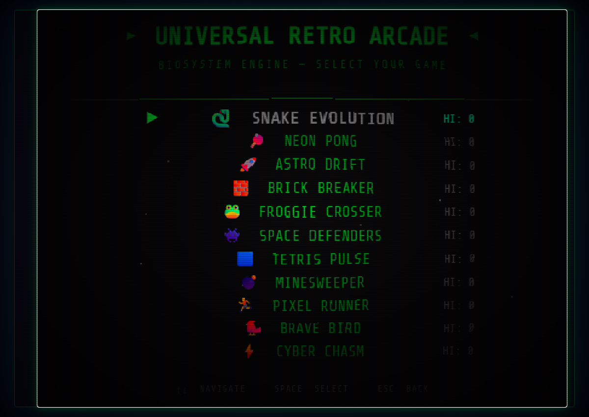
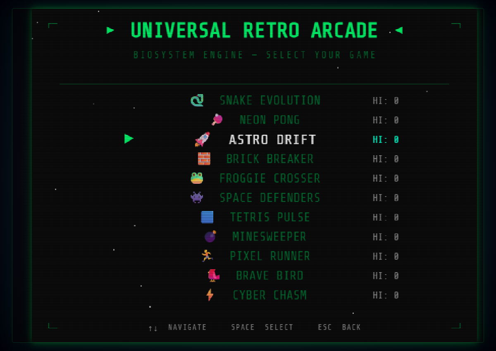
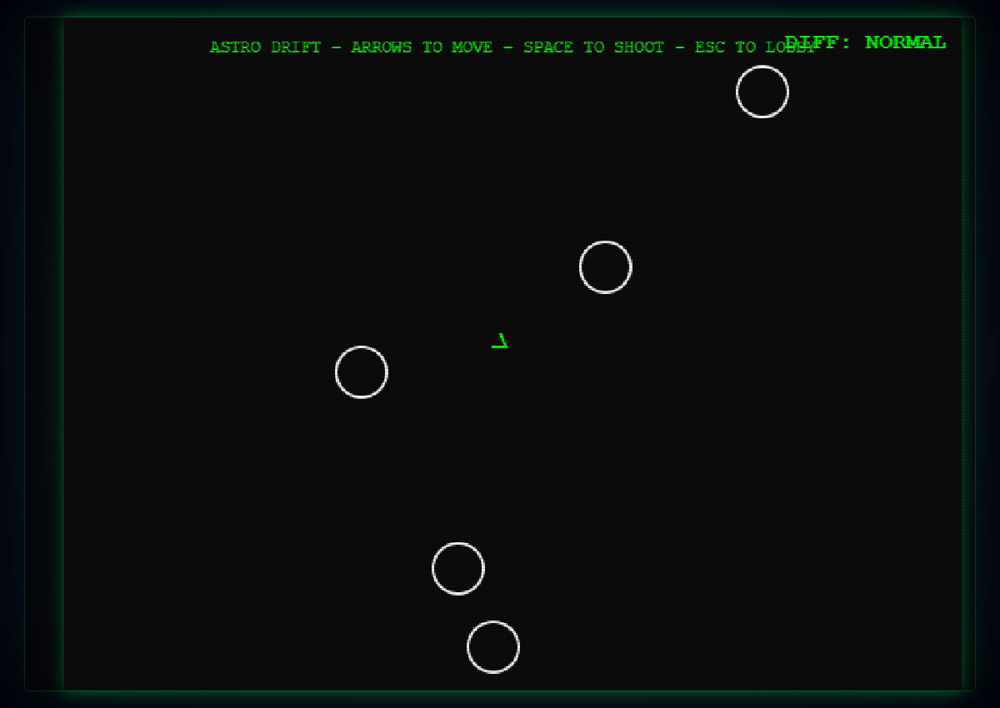
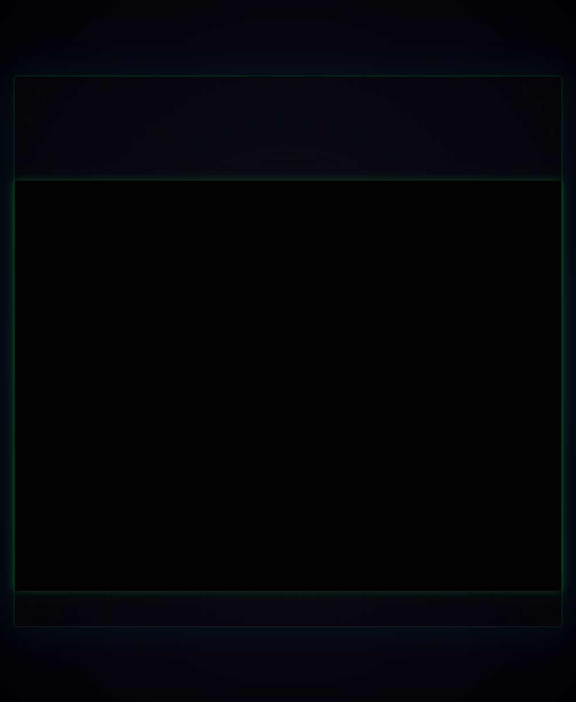
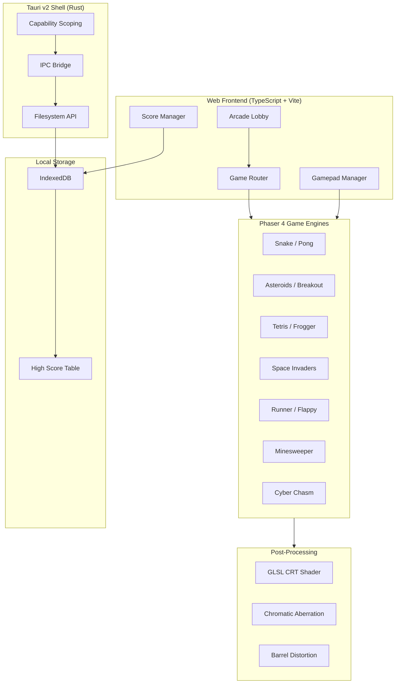

<p align="center">
  
</p>

<p align="center">
  <a href="https://skillicons.dev">
    
  </a>
</p>

<p align="center">
  
  
  
  
  
</p>

<p align="center">
  <strong>🌐 Part of the <a href="https://bios-system.net">BiosSystem Suite</a></strong>
</p>

**Universal Retro Arcade** is a premium, open-source collection of 11 classic and 2000s-era game replicas rebuilt using modern cross-platform web technologies. Optimized for everything from MacBooks to mobile devices.

<p align="center">
  <h3>🎮 Retro Arcade Launcher Lobby</h3>
  
</p>

<p align="center">
  <h3>📺 GLSL CRT Scanline Shader</h3>
  
</p>

<p align="center">
  <h3>🧩 Tetris Replica Gameplay</h3>
  
</p>

<p align="center">
  <h3>🚀 Asteroids Replica Gameplay</h3>
  
</p>

<p align="center">
  <h3>🌌 Cyber Chasm Replica Gameplay</h3>
  
</p>

## 🏗️ Architecture



## ✨ Why It's Unique

Most retro game projects are either standalone web games or bulky emulator frontends requiring illegal ROMs. This is an entirely self-contained arcade:

- **11 Built-In Games** - Snake, Pong, Asteroids, Breakout, Frogger, Space Invaders, Tetris, Minesweeper, Runner, Flappy Bird, and Cyber Chasm. All built from scratch.
- **Hardware Gamepad Support** - Plug-and-play support for Xbox and PlayStation controllers via the HTML5 Gamepad API, automatically mapped to all games.
- **GLSL CRT Shader** - Press `Ctrl+Shift+C` to toggle a hardware-accelerated post-processing pipeline featuring chromatic aberration, barrel distortion, and vignette.
- **Persistent High-Score Board** - Per-game difficulty high scores saved locally with IndexedDB.
- **B-I-O-S Easter Egg** - Type `B-I-O-S` on your keyboard to activate a neon diagnostic overlay.

## 📊 Feature Matrix

| Feature | Universal Retro Arcade | EmulationStation | Web Retro Clones |
|---|:---:|:---:|:---:|
| **Included Games** | 11 Built-in | Requires ROMs | Usually 1 |
| **Binary Size** | <15MB (Tauri v2) | >100MB | N/A |
| **Native Mobile APK** | ✅ | ❌ | ❌ |
| **GLSL CRT Shaders** | ✅ | ✅ | ❌ |
| **Gamepad Support** | ✅ | ✅ | ❌ |

## 🖥️ Platform Support

| Platform | Artifact | Notes |
|---|---|---|
| **macOS** (`arm64`/`x64`) | `.dmg` | Native desktop app via Metal. |
| **Windows** (`x64`) | `.exe` | Standalone installer using WebView2. |
| **Android** (`arm64`) | `.apk` | Touch-optimized controls. |
| **Cloud / Headless** | `.tar.gz` | Remote high-score tracking server. |

## 🚀 Quick Start (Development)

**Step 1.** Install prerequisites:
- [Node.js 20+](https://nodejs.org/)
- [Rust toolchain](https://rustup.rs/)
- Tauri CLI: `npm install -g @tauri-apps/cli`

**Step 2.** Clone the repository:
```bash
git clone https://github.com/BiosSystem/retro-game-replicas.git
cd retro-game-replicas
```

**Step 3.** Install dependencies:
```bash
npm install
```

**Step 4.** Launch the Tauri desktop app in development mode:
```bash
npm run tauri dev
```

**Step 5.** To build a release binary for your platform:
```bash
npm run tauri build
```

The compiled output will appear in `src-tauri/target/release/bundle/`.

## 🕹️ Game List

| Game | Genre | Keyboard Controls | Gamepad |
|---|---|---|---|
| Snake | Arcade | Arrow Keys | D-Pad |
| Pong | Sports | W / S Keys | Left Stick |
| Asteroids | Shooter | WASD + Space | Right Trigger |
| Breakout | Arcade | Mouse | Left Stick |
| Frogger | Arcade | Arrow Keys | D-Pad |
| Space Invaders | Shooter | Arrow Keys + Space | D-Pad + A |
| Tetris | Puzzle | Arrow Keys | D-Pad |
| Minesweeper | Puzzle | Mouse / Touch | N/A |
| Runner | Endless | Space | A Button |
| Flappy Bird | Endless | Space | A Button |
| Cyber Chasm | Platformer | WASD | Left Stick |

## 📖 Documentation

Comprehensive documentation is available in the **[Wiki](https://github.com/BiosSystem/retro-game-replicas/wiki)**.

## 🙏 Credits & Maintenance

All game replica logic, physics tuning, particle systems, CRT shaders, and Tauri integration are designed and maintained by **BiosSystem**.

## 🔒 Security

Universal Retro Arcade enforces strict client sandboxing:

- **Tauri v2 IPC Scoping** - All API interactions between the Phaser frontend and Rust backend are strictly scoped with restricted capabilities configuration.
- **IndexedDB State Verification** - High scores and game states are bounds-checked at runtime to prevent local storage tampering.
- **Shader Bounds Enforcement** - GLSL post-processing scanline shaders are bounds-checked to prevent WebGL resource memory overflow.

For detailed security policies and reporting guidelines, refer to our [Security Policy](SECURITY.md).

*Copyright © 2026 BiosSystem | Powered by BiosSystem Kernel*
