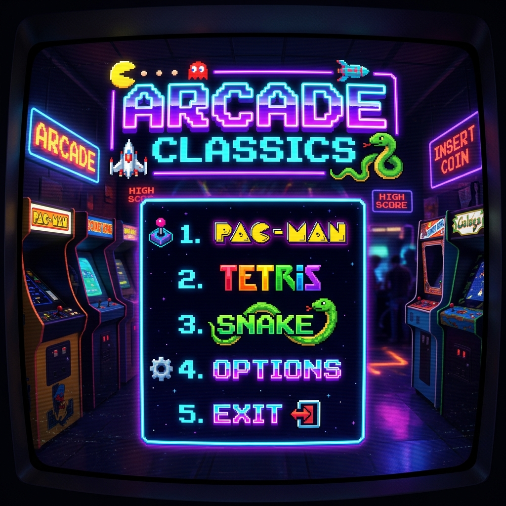

# 🕹️ Universal Retro Arcade Launcher



A premium collection of 11 classic and 2000s-era game replicas rebuilt using modern cross-platform web technologies: **Tauri v2, Vite, TypeScript, and Phaser.js**. Optimized for Macbooks, Windows workstations, Android mobile devices, and Cloud Compute game server hosts.

---

## 🎮 The 11-Game Collection & Core Features

- **Juicy Retro Gameplay**: Screen shake, kinetic physics, glowing CRT shaders, and particle bursts.
- **Tauri v2 Multi-Platform Engine**: Native desktop and mobile execution powered by Rust.
- **Bios System Kernel Diagnostic HUD**: Secret keyboard trigger `B-I-O-S` activating a neon diagnostic overlay displaying frame timing, memory allocation, and kernel verification.

---

## 📦 Multi-Platform Distribution & Deployment (v1.0.0)

Universal Retro Arcade provides tailored distribution artifacts optimized for your specific hardware environment. Each official release includes:

### 1. 🍏 Macbooks (`macOS-arm64`)
*   **Artifact**: `UniversalRetroArcade-macOS-arm64.dmg`
*   **Purpose**: Native Tauri v2 desktop application for Macbooks. Enjoy silky-smooth 60 FPS gameplay with Apple Silicon hardware acceleration.

### 2. 🪟 Windows Workstations (`Windows-x64`)
*   **Artifact**: `UniversalRetroArcade-Windows-x64-Setup.exe`
*   **Purpose**: Standalone Windows installer setup executable. Installs the arcade launcher directly to your desktop.

### 3. 🤖 Android Mobile (`Android-arm64`)
*   **Artifact**: `UniversalRetroArcade-Mobile-Android.apk`
*   **Purpose**: Tauri v2 mobile APK bundle. Play the entire arcade collection on the go with fully optimized touch-screen controls.

### 4. ☁️ Cloud Compute (AWS EC2 / GCP Compute Engine)
*   **Artifacts**: `UniversalRetroArcade-CloudCompute-Linux-x64.tar.gz` & `ghcr.io/BiosSystem/retro-game-replicas:v1.0.0`
*   **Purpose**: Headless game server host and container packaging. Host your own cloud arcade lobby on AWS EC2 or Google Cloud Platform for remote multiplayer high-score tracking.

---

## 🛠️ Setup & Run Locally (Development)

```bash
# Install dependencies
npm install

# Run desktop launcher locally
npm run tauri dev
```

---

## 🙏 Credits & Maintenance

- **BiosSystem**: All game replica logic, physics tuning, juicy particle systems, CRT shader post-processing, launcher UI, and Tauri desktop integration are designed, created, and maintained by **BiosSystem**.

---
*Copyright (c) 2026 by BiosSystem | Powered by Bios System Kernel*
