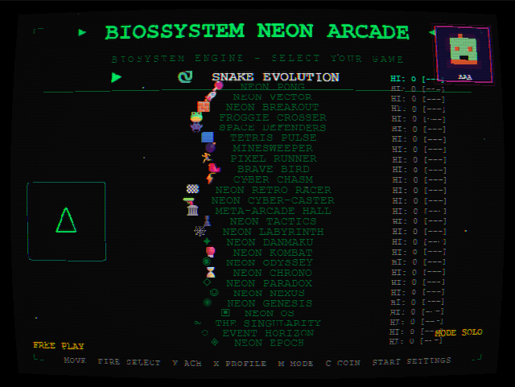
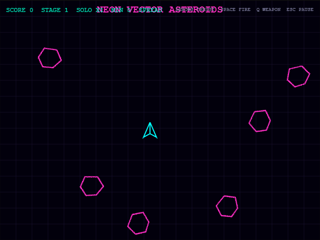
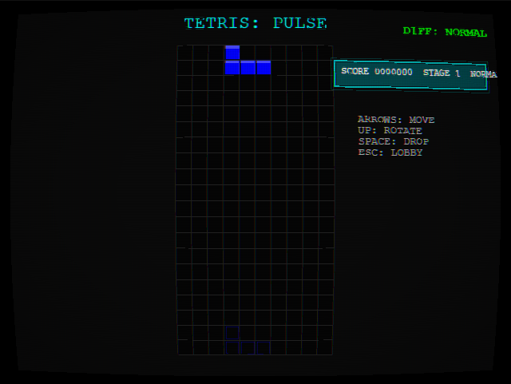
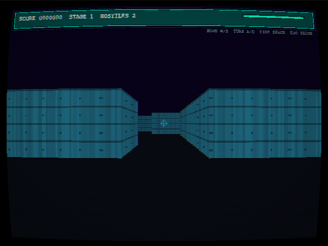
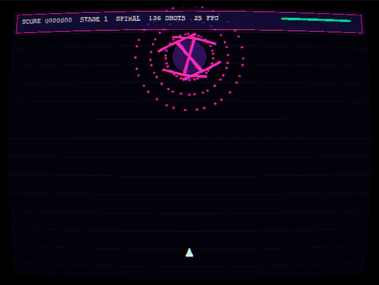
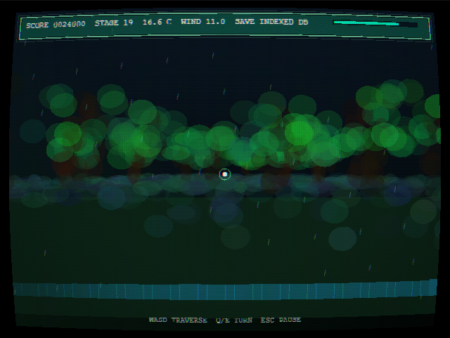

# BiosSystem Neon Arcade

> A procedural retro-futurist arcade platform with 28 original games, a generated Meta-Arcade Hall, and no bundled ROMs or copied game assets.

[](https://github.com/BiosSystem/retro-game-replicas/actions/workflows/release_and_packages.yml)
[](https://github.com/BiosSystem/retro-game-replicas/releases)
[](LICENSE)

**BiosSystem Neon Arcade** keeps the existing `BiosSystem/retro-game-replicas` repository slug for continuity. Build original arcade replicas, procedurally generated Neon worlds, and a cabinet-style launcher from one TypeScript codebase.

## Live game gallery

Capture every image below directly from the current production build. Show procedural runtime graphics only, with no mockups, imported ROM art, or third-party game assets.

<p align="center">
  
</p>
<p align="center"><sub>Browse the complete 29-entry cabinet catalog from the live BiosSystem Neon Arcade lobby.</sub></p>

<table>
  <tr>
    <td width="50%" align="center"><br><sub>Neon Vector - Overdrive vector combat</sub></td>
    <td width="50%" align="center"><br><sub>Tetris Pulse - crisp grid play</sub></td>
  </tr>
  <tr>
    <td width="50%" align="center"><br><sub>Neon Cyber-Caster - generated DDA dungeon</sub></td>
    <td width="50%" align="center"><br><sub>Neon Danmaku - projectile pattern combat</sub></td>
  </tr>
  <tr>
    <td colspan="2" align="center"><br><sub>Neon Epoch - procedural world and Overdrive lighting</sub></td>
  </tr>
</table>

## Quick start

Require Node.js 24 or a compatible current Node runtime.

```bash
git clone https://github.com/BiosSystem/retro-game-replicas.git
cd retro-game-replicas
npm ci
npm run dev
```

Open the Vite address printed by the development server. Build and verify the production web app with:

```bash
npm run lint
npm test
npm run build
npm run baseline
npm run test:regression
npm run test:cross-browser
```

Install Rust only when building the Tauri desktop shell:

```bash
npm run tauri dev
# or
npm run tauri build
```

## Feature matrix

| Area | Current implementation |
|---|---|
| Arcade catalog | 28 original games plus the generated Meta-Arcade Hall |
| Runtime | Phaser 4, TypeScript, Vite, lazy game-scene loading, fixed 60 Hz Arcade Physics |
| Input | Keyboard, touch, Xbox, PlayStation, Nintendo, 8BitDo, arcade encoders, generic controllers, local Player 1 and Player 2 actions |
| Game flow | Difficulty selection, solo and supported local multiplayer modes, pause, restart, shared Game Over, high-score entry, achievements |
| Cabinet UI | Generated Nine Slice panels, animated controls, deterministic local player profiles, procedural avatars, and shared HUD frames |
| Rendering | 640x480 pixel-art canvas, integer 4:3 or 16:9 framing, CRT presets, generated Nine Slice UI, procedural avatars, backgrounds, particles, and effects |
| Audio | Web Audio chiptune tracker, generated effects, spatial cabinet audio, optional AudioWorklet and Wasm DSP paths |
| Persistence | Local score ledgers, preferences, deterministic replays, IndexedDB Neon Epoch save states, generated save previews |
| Connectivity | Manual direct WebRTC peers, local-first verified score gossip, presence mesh, optional spatial voice |
| Extensibility | Validated declarative stage mods, visual graph compiler, signed packages, procedural sound patches |
| Delivery | Offline PWA, hardened Nginx container, loopback-only Compose template, optional Tauri desktop shell |

## Games

**Classic cabinet replicas:** Snake Evolution, Neon Pong, Neon Vector, Neon Breakout, Froggie Crosser, Space Defenders, Tetris Pulse, Minesweeper, Pixel Runner, Brave Bird, and Cyber Chasm.

**Modern arcade games:** Neon Retro Racer, Neon Cyber-Caster, Neon Tactics, Neon Labyrinth, Neon Danmaku, Neon Kombat, Neon Relay, and Prism Spiral.

**Procedural Neon worlds:** Neon Odyssey, Neon Chrono, Neon Paradox, Neon Nexus, Neon Genesis, Neon OS, The Singularity, Event Horizon, and Neon Epoch.

**Hub:** Meta-Arcade Hall generates a walkable DDA-rendered cabinet space with spatial audio and optional connected-peer presence.

## Visual and performance model

Render the core arcade experience at 640x480 with pixel-art sampling. Select Clean Pixel, Arcade CRT 1980s, Trinitron 1990s, or Bypass. Calibrate stable scanline phase and 0% to 8% overscan, then select AUTO, HIGH, MEDIUM, or LOW quality. The CRT path supports gamma-aware bloom, curvature, chromatic aberration, phosphor masks, vignette, program caching, and a source-canvas fallback.

Use Cabinet Control to switch between Classic 1980s and 2026 Overdrive visuals. Classic selects the authentic CRT baseline. Overdrive adds bounded dynamic scene lights, a single pooled GPU particle render node, selective glow for effects, directional camera feedback, and a display-only 30 to 50 ms hit-stop on major impacts. These effects never alter fixed-step simulation, collision bounds, input timing, or replay state. Canvas and headless renderers keep the established pooled-particle fallback.

Open Player Profile with P or the west controller button. Keep one deterministic avatar seed and bounded player name on the device. Reroll the procedural pixel avatar without downloading an image. Reuse the identity in the lobby, high-score entry, and leaderboard center. Render featured-game score, stage, combo, health, and status values through the shared generated HUD contract.

Open Cabinet Control, then Controller Setup, to view live controller inputs and adjust a per-controller scaled-radial or radial deadzone, trigger threshold, and Fire binding. Profiles use a vendor and product fingerprint when available, prevent duplicate bindings, and stay local to the browser. WebHID support is optional and activates only after selecting Connect WebHID from the controller overlay. Disconnecting the primary controller during an active game opens Pause automatically.

Generate gameplay graphics, sprites, particles, previews, levels, worlds, music, and sound effects from code. Several advanced systems, including WebGPU compute, WebXR, WebCodecs, SharedArrayBuffer, AudioWorklet, and Wasm SIMD, activate only after capability checks. Deterministic CPU and browser-safe fallbacks remain the baseline path.

The latest production build contains 201 modules, a 124.92 kB initial bootstrap bundle, a deferred 1,352.40 kB Phaser runtime chunk, and no downloaded UI or avatar asset payload.

## Verification status

The current v2.1 development candidate passes TypeScript analysis, 295 Vitest checks across 102 files, 58 Chromium gameplay and visual regressions, six Firefox and WebKit smoke checks, the production bundle budget, the hardened container validation, and the locked Tauri test profile. The unified-input build is 1,867,197 bytes under the repository's enforced production budget. Follow the live [GitHub Actions workflow](https://github.com/BiosSystem/retro-game-replicas/actions/workflows/release_and_packages.yml) for the latest hosted result.

## Fun Zone container hosting

Build the web app as a dedicated origin. Keep it at the origin root because the PWA and service worker use root-relative paths.

```bash
cp compose.example.yaml compose.yaml
docker compose up --build -d
curl --fail http://127.0.0.1:8080/healthz
```

The tracked Compose template binds only to loopback, uses an unprivileged read-only Nginx runtime, drops Linux capabilities, and enables `no-new-privileges`. Route the public domain to `127.0.0.1:8080` through an HTTPS reverse proxy. Do not embed the app in an iframe because the production security policy denies framing.

## Documentation

- [Architecture](docs/ARCHITECTURE.md)
- [Roadmap](docs/ROADMAP.md)
- [Developer how-to](docs/WIKI_HOWTO.md)
- [Add a game](docs/Adding-Games.md)
- [Contributing](CONTRIBUTING.md)
- [Engine contracts and measured subsystem notes](docs/ENGINE_OVERHAUL.md)
- [Attribution and license register](docs/ATTRIBUTIONS.md)
- [Security policy](SECURITY.md)

## License and attribution

Release source under the [MIT License](LICENSE). Use the original implementations and generated assets in this repository. Review the attribution register before adding third-party software or content. Do not add third-party game ROMs, copied sprites, copied music, or executable community JavaScript.
