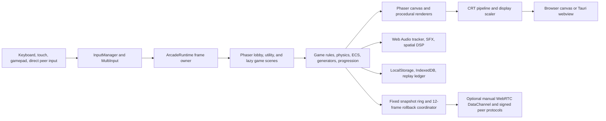

# BiosSystem Neon Arcade Architecture

## Scope

BiosSystem Neon Arcade is a Phaser 4 arcade platform, not a console emulator. The catalog uses original TypeScript game logic and code-generated graphics, levels, effects, and audio. The existing repository slug remains `BiosSystem/retro-game-replicas`.

## Runtime flow



## Core loop and scene lifecycle

`src/bootstrap.ts` creates one 640x480 Phaser game with fixed-step Arcade Physics at 60 Hz. The startup scene set contains the lobby plus Pause, Settings, Achievements, Name Entry, and Game Over utilities. `src/sceneRegistry.ts` dynamically imports each selected game scene so the initial bundle does not include the full catalog.

`ArcadeRuntime` owns frame-level telemetry, visibility handling, controller sampling, global Pause input, CRT preferences, and display scaling. `PhaserDeltaGuard` bounds invalid or long frame gaps to 50 ms while preserving normal high-refresh deltas. Active games use shared pause and game-over contracts. Foreground Phaser overlays and marked DOM utility panels take input priority over gameplay.

### Unified controller input

`GamepadHandler` polls `navigator.getGamepads()` from the runtime animation-frame owner. It detects PlayStation, Xbox, Nintendo, 8BitDo, arcade encoder, and generic fingerprints, then loads a local profile from `bios_arcade_controller_profiles_v1`. Profiles contain radial or scaled-radial stick deadzones, trigger thresholds, and conflict-free canonical button bindings for movement, Fire, Coin, and Start. The handler produces the existing bitmask plus normalized action state, preserving every game scene's input contract.

`ControllerConfigScene` is a generated Nine Slice Cabinet Control overlay. It shows live button states, both trigger thresholds, stick position, and the calibrated deadzone ring. It changes calibration, captures a Fire binding from the next pressed button, resets a controller profile, and exposes WebHID only through explicit user activation. `WebHidTransport` reopens only previously authorized devices and sends raw report events for user-mapped custom controllers. It never requests access automatically.

Input polling duration remains part of `PerformanceBaselineMonitor` and the runtime telemetry HUD. Connection changes emit short toast notifications. A primary controller disconnect pauses only the foreground game through the shared Pause scene, never the lobby or an active utility overlay.

### Deterministic rollback netplay core

`src/core/netplay/` defines the allocation-bounded v2.3 rollback boundary. `DeterministicStateCodec` exposes `saveState`, `loadState`, and `hashState` over caller-owned `StateSnapshot` buffers. `StateSnapshotRing` preallocates its slots before gameplay and restores in place, so rollback does not copy scene objects or allocate arrays while resimulating.

Neon Vector and Tetris Pulse each have a versioned binary codec with fixed capacities. The Vector codec stores two player transforms and a 96-entry projectile pool. The Tetris codec stores a 10 by 20 board and a fixed 4 by 4 active-piece grid. Scene integration stays deliberately separate from the Phaser adapters until each game loop is fully moved to deterministic state data. Existing scenes keep their current offline behavior unchanged.

`RollbackInputRing` stores local, received, and predicted remote inputs in typed-array rings. It permits at most twelve frames of late input. `RollbackCoordinator` restores the prior snapshot, replaces only divergent predicted input, and resimulates to the current fixed tick. This is the replacement path for new netplay-enabled game rules; it does not alter legacy scene physics.

`WebRtcLobby` produces a secure short room identity and a copyable fragment invite around the existing `ARC1` manual SDP exchange. The fragment keeps SDP out of HTTP requests. A client can encode an invite as QR only when the SDP payload fits QR capacity, which manual serverless offers do not guarantee. No discovery service, matchmaking server, automatic microphone request, or network requirement is introduced.

`NetplayController` presents the Cabinet Netplay Lobby as a DOM overlay outside Phaser scene ownership. It renders host and challenger seats, controller-state badges, ready toggles, six-character ambiguity-safe room identifiers, a full manual SDP invite field, and recovery state. `NetworkTelemetry` retains a typed rolling 60-sample latency window, calculates jitter and transport receipt loss, clamps visible rollback depth to eight frames, and recommends zero to two local input-delay frames. `NetplayTelemetryHud` remains a toggleable bezel overlay and never enters the game render surface or fixed simulation clock.

`ShaderWorkshop` owns bounded CRT configuration and local JSON import or export. `ShaderWorkshopController` is a DOM overlay that updates only presentation preferences. `CrtShaderPipeline` merges those values into its existing WebGL barrel, bloom, scanline, mask, vignette, and chromatic uniforms, while the reusable phosphor ping-pong surface supplies presentation-only persistence.

`VersusRules` supplies deterministic Tetris garbage conversion, sixty-tick hash exchange cadence, and a fifteen-second reconnect-forfeit clock. Scene adapters must consume these pure rules through rollback state contracts rather than directly mutating remote Phaser objects.

## Subsystems

| Layer | Responsibility | Key locations |
|---|---|---|
| Core | Phaser bootstrap, frame guard, game loop, progression, replay, score ledger | `src/bootstrap.ts`, `src/engine/` |
| Input | Keyboard, touch, controller profiles, standard gamepad normalization, explicit WebHID transport, hot-plug recovery, local multiplayer routing | `src/core/input/`, `src/engine/InputManager.ts`, `src/engine/input/`, `src/multiplayer/` |
| Scenes | Lobby, game selection, lazy scene registry, pause, settings, achievements, Game Over | `src/scenes/`, `src/sceneRegistry.ts` |
| Gameplay | Original arcade replicas and Neon game modules | `src/scenes/`, `src/games/` |
| Rendering | Canvas pixel art, CRT pass, display scaling, pooled CPU particles, GPU destruction particles, bounded dynamic lights, ray and voxel systems | `src/engine/graphics/`, `src/graphics/` |
| Arcade UI | Generated Nine Slice panels, glow controls, unified HUD frames, profile scenes, and pixel avatars | `src/ui/arcade/`, `src/ui/profile/`, `src/scenes/ProfileScene.ts` |
| Audio | Generated tracker music, effects, spatial audio, optional Worklet and Wasm DSP | `src/audio/`, `src/engine/AudioEngine.ts` |
| Persistence | Preferences, scores, replay ledgers, bounded save-state serialization | `src/engine/persistence/`, `src/engine/ScoreLedger.ts` |
| Networking | Manual WebRTC peers, typed snapshot rollback core, signed scores, CRDT and shard contracts | `src/core/netplay/`, `src/net/`, `src/ui/net/` |
| Extensibility | Declarative mod validation, signed package handling, visual graph bytecode | `src/mods/`, `src/ui/mods/`, `src/ui/studio/` |

## Featured catalog architecture

The lobby exposes 29 lazy-loaded entries. Treat `src/scenes/ArcadeCatalog.ts` as the display contract and `src/sceneRegistry.ts` as the executable registration contract. Keep every scene key identical across both files.

| Catalog entry | Scene key | Runtime role | Primary systems |
|---|---|---|---|
| Neon Vector | `AsteroidsScene` | Procedural vector survival for solo, co-op, and competitive sessions | Infinite stage generation, shared multiplayer session state, versioned binary rollback state contract, weapon and shield pickups, pooled particles, generated vector art |
| Tetris Pulse | `TetrisScene` | Cabinet puzzle loop with increasing speed and shared overlay integration | Grid collision, line clearing, deterministic scoring, versioned 10 by 20 rollback state contract, semantic input compatibility, shared Game Over flow |
| Neon Cyber-Caster | `RaycasterScene` | First-person procedural dungeon combat | Deterministic BSP dungeons, DDA ray casting, sprite projection, bounded collision, generated wall shading |
| Neon Danmaku | `DanmakuScene` | Adaptive bullet-pattern survival benchmark | Fixed-capacity 100,000-projectile ECS, typed arrays, scripted boss phases, adaptive AI director, render-budget sampling |
| Neon Epoch | `EpochScene` | Procedural simulation and graphics showcase | Generated Gaussian splat cloud, capability-gated Wasm SIMD physics, procedural weather and fluid state, IndexedDB save slots and autosave |
| Neon Breaker | `BreakoutScene` | Fixed-step paddle and ball cabinet loop | Deterministic brick fields, bounded power-ups, shared score submission, pooled impact particles, and generated audio feedback |
| Cyber-Racer | `RacerScene` | Fixed-tick pseudo-3D horizon race | Generated scanline road, deterministic horizon palette and city skyline, semantic controller input, bounded exhaust lights, and local score flow |
| Neon Relay | `RelayScene` | Lane-based signal defense for solo or local co-op | Deterministic wave schedule, procedural drones, semantic two-player input, shared score multipliers, pooled screen entities |
| Prism Spiral | `SpiralScene` | Orbital survival for solo or local co-op | Deterministic polar wave schedule, wrap-safe angular collision, semantic two-player input, shared score multipliers, procedural vector geometry |
| Meta-Arcade Hall | `MetaArcadeScene` | Walkable in-world cabinet hub | Generated hall layout, DDA navigation, cabinet scene routing, spatial audio, bounded optional peer presence |

Load these modules only after selection. Preserve deterministic and browser-safe fallbacks when an optional acceleration path is unavailable.

## Rendering and assets

Render native play at 640x480 and scale it with integer 4:3 or 16:9 framing when possible. The CRT output pass exposes Clean Pixel, Arcade CRT 1980s, Trinitron 1990s, and Bypass presets. Each controls source-row-stable scanlines, gamma-aware bloom, lens curvature, chromatic aberration, phosphor shadow mask, vignette, and bounded overscan. Cache linked programs per WebGL context while keeping textures and buffers instance-owned. Let AUTO quality follow the shared telemetry tier or pin HIGH, MEDIUM, or LOW through Cabinet Control.

### UI and profile hierarchy

```text
Lobby, overlays, and featured games
  -> NeonUi generated texture and Nine Slice panels
     -> WebGL Nine Slice batching
     -> Canvas rectangle fallback
  -> ArcadeHud score, stage, combo, health, and status contract
  -> RetroProfileStore bounded local identity
     -> deterministic pixel recipe
     -> Phaser Graphics avatar in lobby and profile scenes
     -> generated leaderboard avatar
```

Keep player identity local to `bios_arcade_profile_v1`. Sanitize names and seeds before persistence. Generate every avatar from its stored seed and use no remote image service. Render one shared generated panel texture per Phaser texture manager. Reuse one HUD frame per featured scene and avoid per-frame object creation.

### Visual modes and feedback pipeline

Cabinet Control persists `arcade_visual_mode` with two explicit visual modes. `CLASSIC_1980S` selects the Arcade CRT 1980s preset and disables the modern GPU feedback layer. `OVERDRIVE_2026` selects the Trinitron 1990s CRT baseline and activates opt-in Phaser WebGL effects. Both modes run the same scene logic, fixed-step physics, hitboxes, scores, and input state.

`SpriteGPULayer` owns one Phaser particle emitter render node, one generated 14 by 14 spark texture, and at most twelve short-lived Phaser lights per scene. It reuses particle capacity and light slots for explosions and hits, applies lighting only to renderable sprite and image objects, and has no Arcade Physics bodies. The emitter receives a selective glow filter while HUD objects stay outside the filter target. Canvas and headless renderers retain the pooled Graphics particle fallback.

`VFXManager` keeps camera shake and chromatic feedback visual-only. Critical impacts request a bounded 30 to 50 ms display-frame hold through `CrtShaderPipeline`, which retains the last submitted WebGL frame without pausing the Phaser scene, physics world, timers, or replay clock. If the CRT path is bypassed or unavailable, the game continues with the existing camera shake and particle fallback.

Neon Breaker and Cyber-Racer use this layer only as a renderer-side enhancement. Breaker impact and brick-destruction callbacks request pooled sparks and bounded lights after deterministic Arcade Physics contacts. Cyber-Racer emits at most one pooled exhaust pulse every 135 ms, schedules its short generated engine tone through the bounded effect allocator, and advances its arcade state at `RACER_TICK_SECONDS`. Neither scene derives score, collision, or progression from visual effects.

Keep assets procedural. Game scenes draw with Phaser primitives, generated buffers, shaders, typed arrays, and Web Audio nodes. Do not add ROM loading or imported copyrighted game art. Optional WebGPU, WebXR, WebCodecs, SharedArrayBuffer, AudioWorklet, and Wasm SIMD paths must retain deterministic browser-safe fallbacks.

### Audio scheduling and underrun telemetry

`AudioVoiceAllocator` caps generated sound effects and patch previews at 24 concurrent voices. It uses a fixed `Float64Array` of release times, so overloaded effects are dropped rather than creating an unbounded graph. `WebAudioTrackerBackend` caches its two pulse waves and limits active scheduled tracker sources to 48. It drops a note only when the graph is already at that hard limit.

The spatial AudioWorklet ring reserves header slots for read position, write position, and missed render quanta. The processor increments the underrun counter once per missed output block. Neon Epoch samples this counter and sends a bounded `arcade-audio-underrun` signal to `PerformanceBaselineMonitor`. The MessagePort fallback remains playable but does not claim shared-ring underrun telemetry.

## Memory and performance discipline

Use typed arrays, fixed-capacity rings, pooled particles, bounded ECS storage, and Worker transfers for heavy paths. Cap frame deltas at 50 ms. The high-volume Danmaku path stores up to 100,000 projectiles in preallocated arrays. Save states, score claims, replay changes, mod packages, and peer messages validate shape and maximum size before use.

Profile gameplay with the built-in telemetry overlay, then run the benchmark and test commands defined in `package.json`. Treat capability-gated compute paths as optimizations, not required runtime dependencies.

`PerformanceBaselineMonitor` enriches the fixed-capacity frame ring with bounded input event, input polling, heap peak, and audio-underrun measurements. It classifies active scenes into low, medium, or high-load budgets without modifying simulation state. Cabinet Control persists telemetry visibility, while the `B-I-O-S` sequence remains available for temporary inspection. Run `npm run baseline` to rebuild the production distribution and enforce bundle-size budgets.

## State machines and storage

The lobby manages game selection, difficulty selection, and supported local arcade modes. Every game can invoke shared Pause and Game Over utilities. Restart copies the source launch payload so difficulty and mode survive. Keyboard Escape closes a visible utility panel first, opens Pause during active play, and retains overlay-specific close behavior.

Store preferences and local score boards in `localStorage`. Store bounded Neon Epoch save states and verified peer claims in IndexedDB. Record deterministic replay input changes locally. Manual direct-peer connections can exchange bounded, signed score and world data, but do not provide public matchmaking, central identity, or an authoritative global leaderboard.

## Delivery

Vite builds the browser app and PWA shell. The `Dockerfile` creates a static Nginx service that runs as UID 10001, exposes `/healthz`, and ships security headers. `compose.example.yaml` restricts local hosting to loopback and a read-only runtime. Tauri packages the same web frontend without custom Rust IPC commands.
