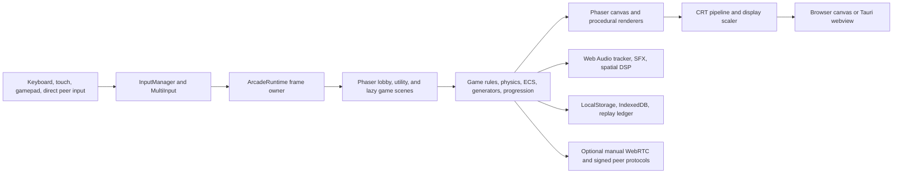

# BiosSystem Neon Arcade Architecture

## Scope

BiosSystem Neon Arcade is a Phaser 4 arcade platform, not a console emulator. The catalog uses original TypeScript game logic and code-generated graphics, levels, effects, and audio. The existing repository slug remains `BiosSystem/retro-game-replicas`.

## Runtime flow

## Core loop and scene lifecycle

`src/bootstrap.ts` creates one 640x480 Phaser game with fixed-step Arcade Physics at 60 Hz. The startup scene set contains the lobby plus Pause, Settings, Achievements, Name Entry, and Game Over utilities. `src/sceneRegistry.ts` dynamically imports each selected game scene so the initial bundle does not include the full catalog.

`ArcadeRuntime` owns frame-level telemetry, visibility handling, controller sampling, global Pause input, CRT preferences, and display scaling. `PhaserDeltaGuard` bounds invalid or long frame gaps to 50 ms while preserving normal high-refresh deltas. Active games use shared pause and game-over contracts. Foreground Phaser overlays and marked DOM utility panels take input priority over gameplay.

## Subsystems

| Layer | Responsibility | Key locations |
|---|---|---|
| Core | Phaser bootstrap, frame guard, game loop, progression, replay, score ledger | `src/bootstrap.ts`, `src/engine/` |
| Input | Keyboard, touch, standard gamepad normalization, local multiplayer routing | `src/engine/InputManager.ts`, `src/engine/input/`, `src/multiplayer/` |
| Scenes | Lobby, game selection, lazy scene registry, pause, settings, achievements, Game Over | `src/scenes/`, `src/sceneRegistry.ts` |
| Gameplay | Original arcade replicas and Neon game modules | `src/scenes/`, `src/games/` |
| Rendering | Canvas pixel art, CRT pass, display scaling, pooled particles, ray and voxel systems | `src/engine/graphics/`, `src/graphics/` |
| Audio | Generated tracker music, effects, spatial audio, optional Worklet and Wasm DSP | `src/audio/`, `src/engine/AudioEngine.ts` |
| Persistence | Preferences, scores, replay ledgers, bounded save-state serialization | `src/engine/persistence/`, `src/engine/ScoreLedger.ts` |
| Networking | Manual WebRTC peers, rollback, signed scores, CRDT and shard contracts | `src/net/`, `src/ui/net/` |
| Extensibility | Declarative mod validation, signed package handling, visual graph bytecode | `src/mods/`, `src/ui/mods/`, `src/ui/studio/` |

## Featured catalog architecture

The lobby exposes 27 lazy-loaded entries. Treat `src/scenes/ArcadeCatalog.ts` as the display contract and `src/sceneRegistry.ts` as the executable registration contract. Keep every scene key identical across both files.

| Catalog entry | Scene key | Runtime role | Primary systems |
|---|---|---|---|
| Neon Vector | `AsteroidsScene` | Procedural vector survival for solo, co-op, and competitive sessions | Infinite stage generation, shared multiplayer session state, weapon and shield pickups, pooled particles, generated vector art |
| Tetris Pulse | `TetrisScene` | Cabinet puzzle loop with increasing speed and shared overlay integration | Grid collision, line clearing, deterministic scoring, semantic input compatibility, shared Game Over flow |
| Neon Cyber-Caster | `RaycasterScene` | First-person procedural dungeon combat | Deterministic BSP dungeons, DDA ray casting, sprite projection, bounded collision, generated wall shading |
| Neon Danmaku | `DanmakuScene` | Adaptive bullet-pattern survival benchmark | Fixed-capacity 100,000-projectile ECS, typed arrays, scripted boss phases, adaptive AI director, render-budget sampling |
| Neon Epoch | `EpochScene` | Procedural simulation and graphics showcase | Generated Gaussian splat cloud, capability-gated Wasm SIMD physics, procedural weather and fluid state, IndexedDB save slots and autosave |
| Meta-Arcade Hall | `MetaArcadeScene` | Walkable in-world cabinet hub | Generated hall layout, DDA navigation, cabinet scene routing, spatial audio, bounded optional peer presence |

Load these modules only after selection. Preserve deterministic and browser-safe fallbacks when an optional acceleration path is unavailable.

## Rendering and assets

Render native play at 640x480 and scale it with integer 4:3 or 16:9 framing when possible. The CRT output pass exposes Clean Pixel, Arcade CRT 1980s, Trinitron 1990s, and Bypass presets. Each controls scanlines, bloom, lens curvature, chromatic aberration, phosphor shadow mask, and vignette.

Keep assets procedural. Game scenes draw with Phaser primitives, generated buffers, shaders, typed arrays, and Web Audio nodes. Do not add ROM loading or imported copyrighted game art. Optional WebGPU, WebXR, WebCodecs, SharedArrayBuffer, AudioWorklet, and Wasm SIMD paths must retain deterministic browser-safe fallbacks.

## Memory and performance discipline

Use typed arrays, fixed-capacity rings, pooled particles, bounded ECS storage, and Worker transfers for heavy paths. Cap frame deltas at 50 ms. The high-volume Danmaku path stores up to 100,000 projectiles in preallocated arrays. Save states, score claims, replay changes, mod packages, and peer messages validate shape and maximum size before use.

Profile gameplay with the built-in telemetry overlay, then run the benchmark and test commands defined in `package.json`. Treat capability-gated compute paths as optimizations, not required runtime dependencies.

## State machines and storage

The lobby manages game selection, difficulty selection, and supported local arcade modes. Every game can invoke shared Pause and Game Over utilities. Restart copies the source launch payload so difficulty and mode survive. Keyboard Escape closes a visible utility panel first, opens Pause during active play, and retains overlay-specific close behavior.

Store preferences and local score boards in `localStorage`. Store bounded Neon Epoch save states and verified peer claims in IndexedDB. Record deterministic replay input changes locally. Manual direct-peer connections can exchange bounded, signed score and world data, but do not provide public matchmaking, central identity, or an authoritative global leaderboard.

## Delivery

Vite builds the browser app and PWA shell. The `Dockerfile` creates a static Nginx service that runs as UID 10001, exposes `/healthz`, and ships security headers. `compose.example.yaml` restricts local hosting to loopback and a read-only runtime. Tauri packages the same web frontend without custom Rust IPC commands.
